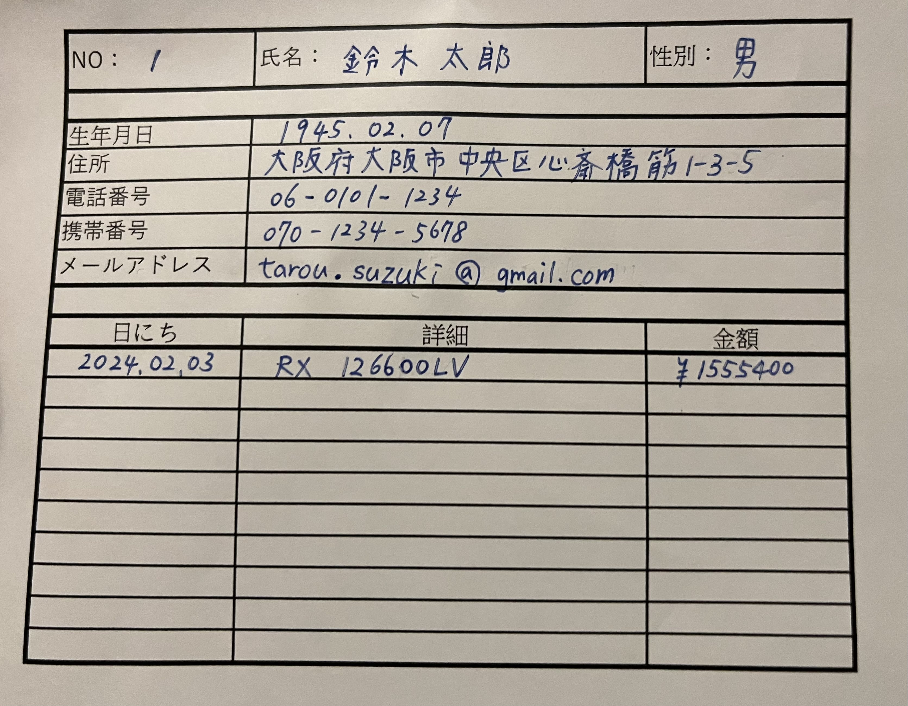
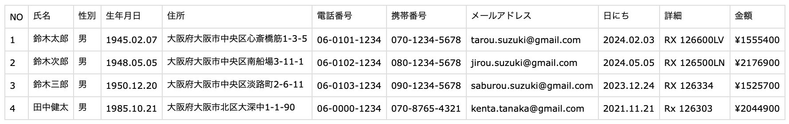

# 概要
お客様カードに手書きで記入した文字を生成AIを用いて認識し結果をcsvとして保存するプログラム。  
本プログラムではお客様カードのダミーデータ4枚を作成し`gpt-4o`を使って手書き文字認識を実施。  
結果すべての場合で内容が読み取れることを確認しました。

-----------------------------------
### お客様カードの例


### 読み取り結果

※お客様データはすべてダミーで作成したものです

-----------------------------------
# 作成理由
前職ではお客様に記入いただいた個人情報をPCに手入力する必要があり、入力作業にかかる工数が大きな問題となっていました。多い時には1日の業務が入力作業のみとなる場合があり、時計の販売に着手できない状況でした。そこで、入力作業を効率化しデータ管理を容易にするため本プログラムを作成しました。また、生成AIなどの新しい技術を習得したかったことも理由の1つです。

# 実行方法
1. プログラムとサンプル画像をダウンロードする
```
git clone https://github.com/harumi0403/portfolio
```

2. Open AI APIキーを設定する
```
# 方法1: .bashrc等のシェルの設定ファイルに下記の行を追加する
OPENAI_API_KEY = /* APIキー */
# 方法2: main.pyの37行目にAPIキーを記入する
client = OpenAI(api_key=/* APIキー)
```
3. プログラムを実行する
```
python src/main.py
```

4. 結果を確認する
- プロジェクトのルートに`result.csv`が生成されていることと読み取り内容が正しいことを確認
